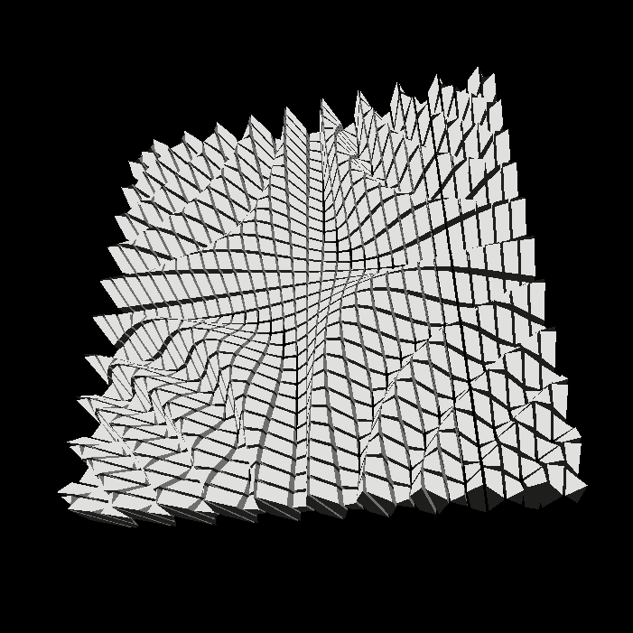

# Sine wave vertex shader on a box grid geometry in THREE.js
Created while fiddling around with THREE.js and reading [shader introduction tutorials](https://aerotwist.com/tutorials/an-introduction-to-shaders-part-1/#bonjourno-world)

# Example

